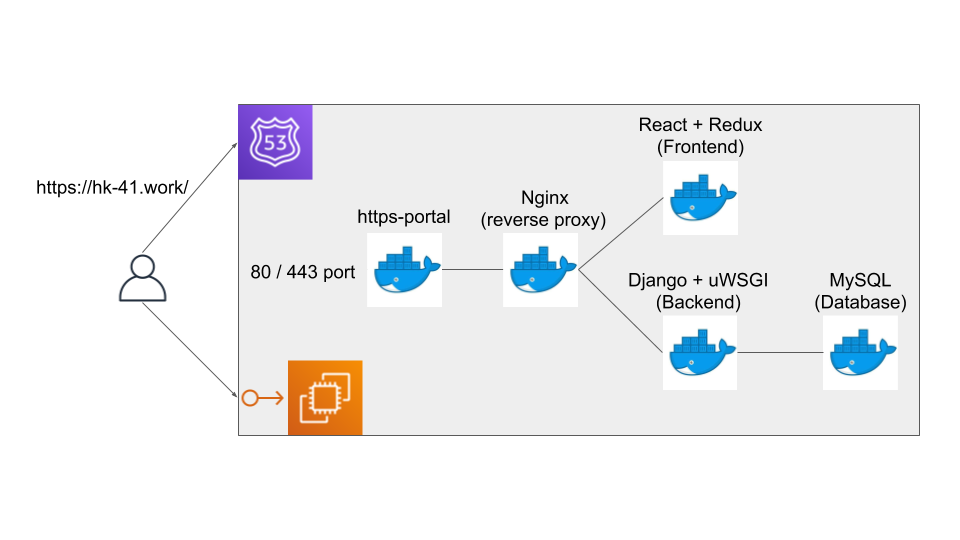

# hk-41

## 概要

- このリポジトリは [ポートフォリオ](https://hk-41.work/) のソースコードです。
- GitHub Pages でデプロイしたポートフォリオは [こちら](dilmnqvovpnmlib.github.io/dilmnqvovpnmlib/) になります。

## 使用した技術

- AWS の `EC2` に `Route53` と `Elastic IP` を使用し、 `Docker` と `docker-compose` を使ってデプロイしています。
- フロントエンドには `React` と `styled-components` と `Ant Desig` を使用して、 `Functional Component` で実装しています。
- ブラウザから修正できるように、バックエンドに `Django Rest Framework` を使って管理画面を作成している途中です。

## 構成図



## 起動

- 開発環境は、`Docker` + `docker-compose` + `make` を用いて構築します。

### 開発環境

- 開発環境では、以下の手順でアプリケーションを起動します。フロントエンドのアプリケーションは `https://www.dev.localhost/` でアプリケーションは起動します。
- 開発環境のマシンの `/etc/hosts` に `127.0.0.1 www.dev.localhost` に追記しておく必要があります。

- フロントとバックエンドは開発用サーバーで起動していて、ローカルのプログラムを変更すると変更が反映されるようになっています。

```bash
make dev-build
make dev-up
```

- コンテナを落とす時は、以下のコマンドを実行します。

```bash
make dev-down
```

### 本番環境をテスト

- 開発環境では、以下の手順でアプリケーションを起動します。フロントエンドのアプリケーションは `https://www.dev.localhost/` でアプリケーションは起動します。

- フロントはビルドしたファイルを配信し、バックエンドは uWSGI を使って起動しています。

```bash
make test-build
make test-up
```

- コンテナを落とす時は、以下のコマンドを実行します。

```bash
make test-down
```

### 本番環境

- 本番環境では、以下の手順でアプリケーションを起動します。
- デプロイする際に、最新の build したファイルを push しておく必要があります。

- フロントはビルドしたファイルを配信し、バックエンドは uWSGI を使って起動しています。

```bash
make prod-build
make prod-up
```

- コンテナを落とす時は、以下のコマンドを実行します。

```bash
make prod-down
```
